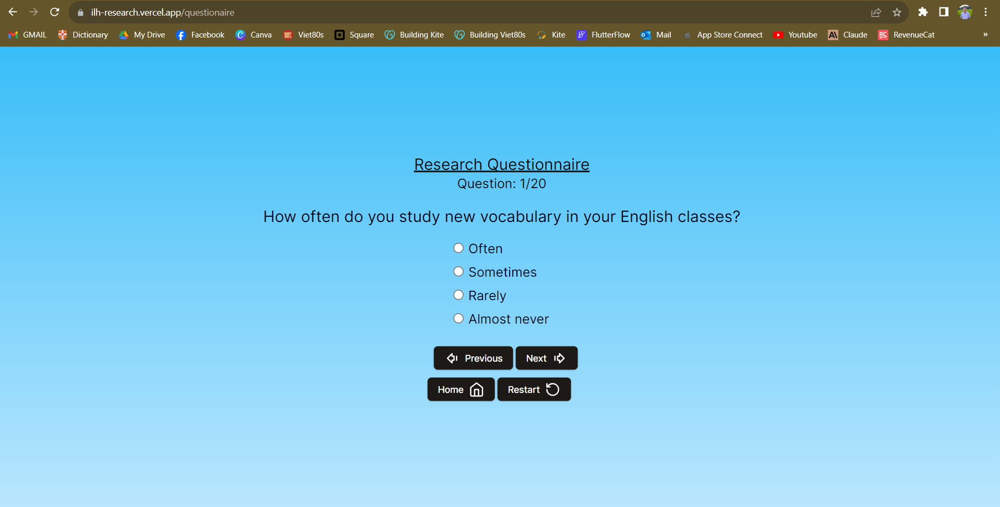
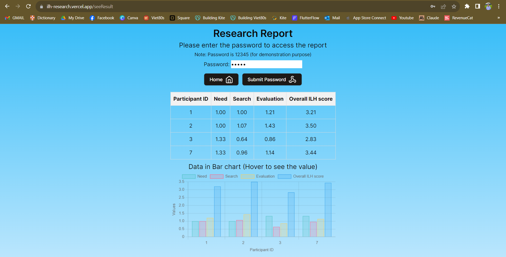

# Involvement Load Hypothesis Research Questionnaire

This application is a research questionnaire to measure the effectiveness of vocabulary learning methods based on the Involvement Load Hypothesis (ILH) principles.

It allows researchers to easily create ILH questionnaires, distribute them globally, and analyze results through interactive data visualizations.

## Overview
The ILH theory posits vocabulary learning is more effective when it incorporates a higher involvement load - i.e. need, search, and evaluation.

This app measures ILH scores through 3 categories of questionnaire questions:

- Need - the necessity of learning vocabulary
- Search - the effort to understand vocabulary meaning
- Evaluation - assessing vocab knowledge
Based on user responses, it calculates category scores and total ILH scores. The results are displayed in a bar chart showing the breakdown and total score.

It enables researchers to quickly evaluate vocab learning methods and iterate on questionnaires.







## Installation <a name="installation"/>

This is a [Next.js](https://nextjs.org/) project bootstrapped with [`create-next-app`](https://github.com/vercel/next.js/tree/canary/packages/create-next-app).

First, run the development server:

```bash
npm run dev
# or
yarn dev
# or
pnpm dev
# or
bun dev
```

Open [http://localhost:3000](http://localhost:3000) with your browser to see the result.


## Demo
A live demo is available here:

https://ilh-research.vercel.app/

Try it out by logging in, taking a short questionnaire and seeing the results!

## Hosting
ChatPDF is currently hosted on Vercel and leverages its serverless platform for scale, speed, and ease of use. The front-end application is hosted on Vercel Edge locations around the world to minimize latency. PDF documents are stored in AWS S3 buckets in relevant regions.

The UI is a progressive web app that caches content like App Shell architecture. Pages render extremely quickly even for complex pages due to granular caching and static optimization.

## Table of Contents
### 1. [Installation](#installation)
### 2. [Usage](#usage)
### 3. [Contributing](#contributing)
### 4. [Credits](#credits)


## Usage <a name="usage"/>

### Taking Questionnaire around the world

- Answer questions belonging to the 3 ILH categories
- Select answer choices with point values

### Viewing Results

- Researcher see the results using password: 12345
- Interactive bar chart shows score breakdowns
- Updates in real-time as respondents submit

### Managing Questionnaires

- Researchers can edit/update questions
- Add/modify answer choices and point values

## Technologies
- Next.js web application
- TypeScript + React
- Tailwind CSS styling
- Vercel hosting
- Recharts for data visualization

## Contributing <a name="contributing"/>

Pull requests are welcome. For major changes, please open an issue first to discuss what you would like to change.

## Credits <a name="credits"/>

This app was created for [Ivana Slavikova](https://www.linkedin.com/in/ivanaslavikova/) (ESOL teacher and PhD provisional candidate at Nottingham Trent University) to facilitate her ILH research questionnaire.

[Tri Thien Nguyen](https://www.linkedin.com/in/tri-thien-nguyen/)
